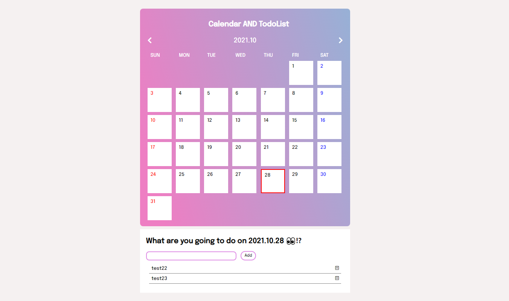

# 💻[토이프로젝트] VanillaJS_CalendarToDoList
    바닐라자바스크립트로 구현한 투두리스트에 캘린더 기능을 추가하여 날짜별로 투두리스트를 관리할 수 있도록 하는 것을 목표로 했다.
   
  

## ⚙구현 목표
* 캘린더 구현 
* 날짜별 todolist 입력 
* 날짜별 todolist 삭제 
* localstorage 연동

  

## ✅구현 방법

  

## ✨최종 구현 결과

[결과물 보러가기](https://ahn-sujin.github.io/VanillaJS_CalendarToDoList/html/calendar02.html)

  

### 참고
https://taejinkim-devlog.tistory.com/27

#### Contact 
:envelope: asj9674@gmail.com
